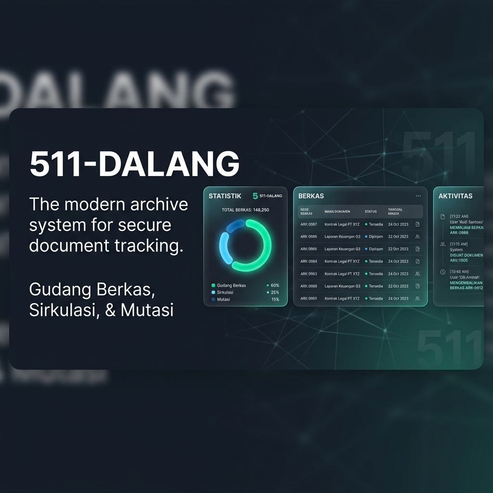

# 🏛️ 511-DALANG (Gudang Berkas)

<p align="center">
  <a href="#-bahasa-indonesia">Bahasa Indonesia</a> | 
  <a href="#-english">English</a> | 
  <a href="#-dokumentasi-operasional">Dokumentasi</a> | 
  <a href="#-skema-keamanan">Keamanan</a> | 
  <a href="#-kontribusi">Kontribusi</a>
</p>

---

<p align="center">
  
</p>

<p align="center">
  
  
  
  
  
</p>

---

## 📖 Pendahuluan (Introduction)

**511-DALANG** adalah sistem informasi manajemen pengarsipan dan pelacakan berkas fisik Wajib Pajak (induk maupun cabang) yang dirancang untuk kebutuhan internal kantor secara *Enterprise-Grade*. Aplikasi ini memfasilitasi administrasi penyimpanan berkas di gudang, pelacakan sirkulasi (peminjaman dan pengembalian), serta pencatatan mutasi lokasi rak penyimpanan secara presisi.

Sistem dibangun menggunakan arsitektur modern yang memisahkan **React 19** (Frontend) dengan **Flask 3 & SQLAlchemy ORM** (Backend), serta dikemas menggunakan **WSGI Production Server** yang andal untuk penggelaran di jaringan lokal (LAN) kantor.

---

## 🏛️ Arsitektur Teknologi (System Architecture)

Aplikasi ini menggunakan tumpukan teknologi modern, efisien, dan andal:

```
┌─────────────────────────────────────────────────────────┐
│                    React 19 Frontend                    │
│     (Vite, Tailwind CSS 4, CSS Conic-Gradient Charts)   │
└────────────────────────────┬────────────────────────────┘
                             │ (REST API / JWT Bearer)
                             ▼
┌─────────────────────────────────────────────────────────┐
│                    Flask 3 WSGI Backend                 │
│        (SQLAlchemy ORM, Alembic, Flask-Limiter)         │
└────────────────────────────┬────────────────────────────┘
                             │
                             ▼
┌─────────────────────────────────────────────────────────┐
│                   SQLite Database File                  │
│       (gudang.db - Indeks & Kunci Asing Terintegrasi)   │
└─────────────────────────────────────────────────────────┘
```

### Komponen Utama:
- **Frontend:** React 19, Vite (bundler ultra cepat), Tailwind CSS v4, dan visualisasi diagram murni CSS (*pure CSS conic-gradient donut chart*) untuk kestabilan peramban maksimal.
- **Backend:** Flask 3, Flask-JWT-Extended (pengamanan sesi token), Flask-Limiter (perlindungan DDoS lokal), dan SQLAlchemy ORM (menghilangkan risiko SQL Injection).
- **Database & Migrasi:** SQLite (ringan dan bebas biaya operasional) yang dipadukan dengan **Alembic** untuk penanganan evolusi skema tabel secara otomatis.
- **Server Produksi:** **Waitress WSGI** (Windows) dan **Gunicorn** (Linux) untuk menjamin stabilitas konkurensi multi-user.

---

## 🛠️ Panduan Instalasi & Pengoperasian Lokal (Setup Guide)

Ikuti langkah-langkah di bawah ini untuk memasang dan menjalankan aplikasi 511-DALANG di komputer pengembangan atau server LAN kantor Anda:

### 1. Prasyarat Sistem
- **Python:** Versi `3.10` atau `3.11` (Sangat direkomendasikan karena Python 3.9 telah memasuki EOL).
- **Node.js:** Versi `18` atau `20` (LTS).

---

### 2. Pemasangan Backend (API Server)

1. Masuk ke direktori utama aplikasi dan buat virtual environment:
   ```bash
   python -m venv venv
   ```
2. Aktifkan virtual environment Anda:
   - **Windows (PowerShell):**
     ```powershell
     .\venv\Scripts\Activate.ps1
     ```
   - **Linux/Mac:**
     ```bash
     source venv/bin/activate
     ```
3. Tingkatkan versi `pip` dan pasang seluruh pustaka dependensi:
   ```bash
   python -m pip install --upgrade pip
   pip install -r requirements.txt
   ```
4. Salin template lingkungan `.env.example` menjadi berkas baru bernama `.env`:
   ```bash
   copy .env.example .env
   ```
5. Buka berkas `.env` yang baru dibuat dan sesuaikan konfigurasinya:
   ```env
   JWT_SECRET_KEY=isi_dengan_string_acak_minimal_32_karakter
   ADMIN_USERNAME=admin
   ADMIN_PASSWORD=sandi_admin_kuat_anda
   ALLOWED_ORIGINS=http://localhost:5173
   ```

---

### 3. Pemasangan & Build Frontend (React Client)

1. Masuk ke direktori frontend:
   ```bash
   cd frontend
   ```
2. Pasang seluruh dependensi Node.js:
   ```bash
   npm install
   ```
3. Konfigurasikan berkas lingkungan frontend `.env` di dalam folder `frontend/`:
   ```env
   VITE_API_URL=http://localhost:5000
   ```
   *(Untuk deploy server LAN kantor, ubah `localhost` menjadi IP lokal server Anda, misalnya: `http://192.168.1.100:5000`)*
4. Lakukan kompilasi (*build*) berkas frontend untuk kebutuhan produksi:
   ```bash
   npm run build
   ```

---

### 4. Menjalankan Server Produksi (Deployment)

Aplikasi ini telah dilengkapi dengan WSGI entrypoint **`wsgi.py`** yang otomatis mengurus migrasi skema database, pembuatan akun admin pertama, dan pengaktifan pencadangan otomatis saat server dinyalakan.

- **Pada Sistem Operasi Windows (Waitress):**
  Cukup klik dua kali berkas **`run_server.bat`** pada direktori utama proyek.
- **Pada Sistem Operasi Linux (Gunicorn):**
  Jalankan skrip shell:
  ```bash
  chmod +x run_server.sh
  ./run_server.sh
  ```

---

## 💾 Pengelolaan Database & Pencadangan Otomatis

### 1. Migrasi Data Wajib Pajak (SQLite Copy-Paste)
Karena database SQLite menggunakan arsitektur berkas tunggal (*single-file database*), proses pemindahan data 2509 entri Wajib Pajak aktif ke server lokal kantor Anda dapat diselesaikan dengan **sangat mudah**:
1. Jalankan `run_server.bat` sekali di server target untuk menginisialisasi skema awal.
2. Salin berkas **`instance/gudang.db`** (ukuran ~868 KB) dari PC pengembangan Anda.
3. Tempel (*paste*) dan timpa berkas tersebut ke folder `/instance` pada server lokal baru Anda.
4. Nyalakan kembali server, dan seluruh data wajib pajak beserta log aktivitas langsung aktif secara instan!

### 2. Background Auto-Backup Daemon
Aplikasi memiliki utas latar belakang (*background thread daemon*) yang memantau waktu secara berkala. **Setiap hari pada pukul 02:00 Pagi**, aplikasi akan membuat berkas cadangan database secara otomatis di dalam direktori `/backups` dengan format penamaan tanggal: `gudang_backup_YYYYMMDD.db`.

---

## 🔒 Skema Keamanan & Otorisasi

Aplikasi dirancang dengan standar keamanan enterprise yang ketat untuk penggelaran LAN kantor:
- **Role-Based Access Control (RBAC):** Otentikasi berlapis yang membedakan hak akses antara `superuser` (mengelola user, mengunduh backup, ekspor CSV), `petugas` (mengisi dokumen berkas, memproses sirkulasi), dan `user` biasa (hanya melihat/mencari berkas).
- **Autentikasi JWT Aman:** Enkripsi token JWT dengan validasi tanda tangan (*signature*) penuh di tingkat server untuk setiap request API.
- **Rate Limiting:** Pengamanan DoS internal via `Flask-Limiter` yang membatasi ketat request pada API sensitif (misal: login dibatasi maks 20 per menit).
- **MIME Type Validation:** Menggunakan pustaka `python-magic` (libmagic) untuk memvalidasi tipe file unggahan PDF secara biner, mencegah infiltrasi malware berkamuflase ekstensi.

---

## 🤝 Kontribusi & Standar Kerja (Contributing)

Jika Anda ingin menambahkan fitur baru atau melakukan perbaikan kode:
1. Buat cabang baru dari `main` dengan format penamaan yang manusiawi (misal: `feat/tambah-pencarian-nitku` atau `fix/mismatch-tanggal`).
2. Tulis kode yang rapi, berikan komentar yang fungsional (bukan komentar bergaya bot/mesin), dan pastikan unit test lolos.
3. Jalankan pengujian lokal untuk memverifikasi fungsionalitas:
   ```bash
   python -m pytest
   ```
4. Buat Pull Request (PR) untuk ditinjau secara manual sebelum digabungkan ke cabang utama.
